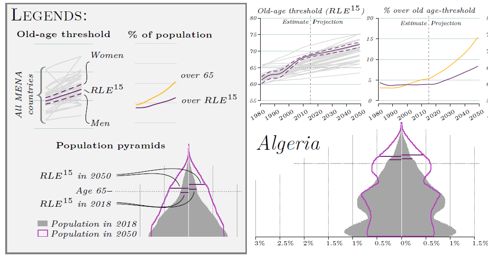
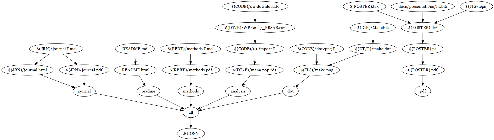

## Population Ageing in the Middle East and North Africa
#### Measuring Population Ageing Using Propspective Instead of Chronological Age

### Population Horizons - Factsheet Vol 14 Issue 2

*Repository for analysis and design of the factsheet---and any interactive visualisations that may follow--- for the 14(2) issue of Population Horizons.*

##### **Quick links:**

Depending on what you are after, this repository includes the following:

* The factsheet/poster itself---[PH14.02.Factsheet.pdf](docs/presentations/PH14.02.Factsheet.pdf)
* The prospective age *old-age threshold* calculated for all 20 countries for the period 1953-2098 along with the proportions of the population over 65 and over the threshodl---[final.data.csv](results/human-readable/final.data.csv)
* The methodology write-up for the calculation of the old-age thresholds---[methods.pdf](docs/reports/methods.pdf)

### Table of Contents :

1. Poster
2. Data and Methods Summary
3. Technical summary - Makefile

### 1. Poster

The factsheet---which is best enjoyed printed out as a poster---uses propsecive age to give a comparative overview of the ageing of the populations of the MENA countries. 

Here's an extract of the legends and the charts for Algeria. 

### 2. Methods summary

The MENA data analysis is currenlty included in this repository and the methodology explained in the [methods.pdf](docs/reports/methods.pdf) file. It will soon be moved to its own repository and deposited on figshare---not just for MENA countries but for all the countries in UN Population Prospects. Watch this space. 

### 3. Technical summary

Theoretically this repository is self-contained and the `Makefile` should run all the analysis, plot all the figures and compile the poster, including supplementary analyses. See the chart below to see what it looks like. To run the whole project you will require a working instalations of python, LaTeX and R to run. Tested on Windows 10.

##### Prerequisites

R, Rstudio (pandoc, make), Python, some sort of unzipping utility... If it works, don't break it.

### Authors

* **Maja Zalo&zcaron;nik**

## License

This project is licensed under the ?