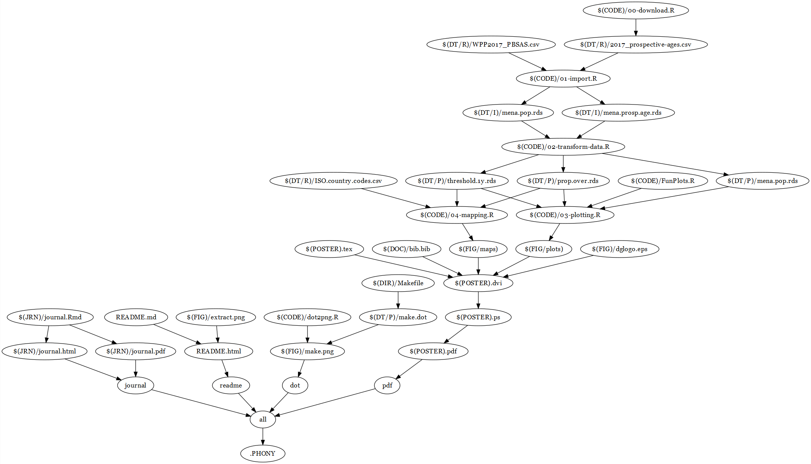

## Population Ageing in the Middle East and North Africa
#### Measuring Population Ageing Using Propspective Instead of Chronological Age

### Population Horizons - Factsheet Vol 14 Issue 2

*Repository for analysis and design of the factsheet---and any interactive visualisations that may follow--- for the 14(2) issue of Population Horizons.*

Theoretically this repository is self-contained and the `Makefile` should run all the analysis, plot all the figures and compile the poster, including supplementary analyses. See the bottom of this REASME to see what it looks like. To run the whole project you will require a working instalations of python, LaTeX and R to run. Tested on Windows 10.

### 

